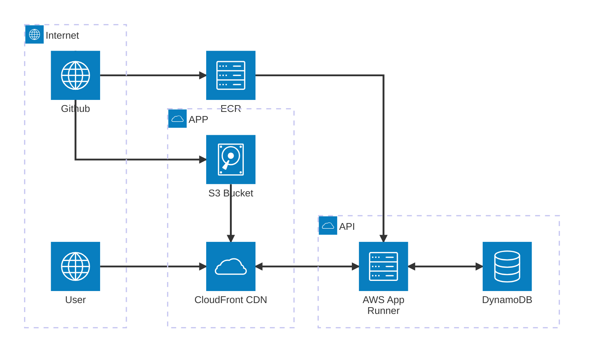

# Infrastructure (CDK Go)

This CDK app defines **two stacks** that reference each other via CloudFormation exports:



**Base stack** (`base_stack.go`): S3 bucket for static assets, ECR repository, IAM role for App Runner to pull from ECR, and optionally the GitHub OIDC role for ECR push. Exports: ECR URI, App Runner ECR access role ARN, S3 bucket name.

**App stack** (`app_stack.go`): App Runner service (uses ECR and role from base) and CloudFront distribution (App Runner as default origin, S3 for `/static/*`). Imports the base stack outputs.

**Shared** (`constants.go`): Shared configuration constants and export names. `infrastructure.go`: main entry, context helpers, and GitHub OIDC role creation (used by base stack).

## Configuration (cdk.json)

Settings are read from the `context` section of `cdk.json` (and can be overridden with `cdk -c key=value`):

| Key | Default | Description |
|-----|---------|--------------|
| `ecrRepositoryName` | `unsw-comp3900-app` | ECR repository and App Runner service name. |
| `githubOwner` | `""` | GitHub org or username for OIDC; if set with `githubRepo`, creates the ECR-push role. |
| `githubRepo` | `""` | GitHub repository name for OIDC. |
| `githubBranch` | `main` | Optional branch restriction for OIDC (e.g. `main`); leave empty in cdk.json to allow any ref. |

Example: set `githubOwner` and `githubRepo` in `cdk.json` to enable the GitHub Actions OIDC role without changing Go code.

## Prerequisites

- AWS CLI configured (account/region).
- Node.js (for `cdk` CLI).
- Go 1.24+.

## Useful commands

- `cdk deploy --all`     – Deploy both stacks (deploy **BaseStack** first, then **AppStack**).
- `cdk deploy BaseStack` – Deploy only the base stack (S3, ECR, IAM).
- `cdk deploy AppStack`  – Deploy only the app stack (requires base stack outputs).
- `cdk diff`             – Compare deployed stacks with current state.
- `cdk synth`            – Emit the synthesized CloudFormation templates.
- `go test`              – Run unit tests.

## Deploy order

1. Deploy the **base stack** first: `cdk deploy BaseStack`
2. Push at least one Docker image to the ECR repository (see After deploy).
3. Deploy the **app stack**: `cdk deploy AppStack` (it imports the base stack outputs; App Runner will pull the image from ECR).

## After deploy

1. **ECR** – Build and push your image (tag `latest` or update the stack to use another tag):
   ```bash
   aws ecr get-login-password --region <region> | docker login --username AWS --password-stdin <account>.dkr.ecr.<region>.amazonaws.com
   docker build -t <account>.dkr.ecr.<region>.amazonaws.com/unsw-comp3900-app:latest .
   docker push <account>.dkr.ecr.<region>.amazonaws.com/unsw-comp3900-app:latest
   ```
2. **App Runner** – In the AWS Console (or CLI), start a **manual deployment** for the service so it picks up the new image.
3. **Static assets** – Upload objects to the S3 bucket; they are available at `https://<cloudfront-domain>/static/<key>`.
4. **Public URL** – Use the **CloudFrontDistributionUrl** output from **AppStack** as the main entry point for the app and static content.

## GitHub Actions push to ECR (OIDC)

### How GitHub connects to ECR (no long‑lived keys)

The link is **OIDC**: the workflow asks GitHub for a short‑lived token, then uses it to assume the IAM role in AWS. Nothing in AWS “calls” GitHub; the **workflow runs in GitHub** and initiates the connection.

| Where | What’s configured |
|-------|--------------------|
| **AWS (our CDK)** | **Base stack** creates: (1) an IAM OIDC provider for `https://token.actions.githubusercontent.com`, (2) an IAM role whose **trust policy** allows that provider to assume it only when the token’s `sub` matches your repo (and optional branch), (3) ECR push permissions on that role. The role ARN is in the **GitHubECRPushRoleArn** stack output. |
| **GitHub** | In the **repo**: (1) a **secret** (e.g. `AWS_ROLE_ARN`) set to that role ARN, (2) a **workflow** that requests an OIDC token (`id-token: write`) and calls `configure-aws-credentials` with `role-to-assume: ${{ secrets.AWS_ROLE_ARN }}`. The action exchanges the token for temporary AWS credentials and uses them for `docker push` to ECR. |

So: **AWS side** = OIDC provider + role + ECR policy (in `base_stack.go` / `infrastructure.go`). **GitHub side** = workflow + secret holding the role ARN; that’s where “GitHub connects to AWS” is configured.

### Setup

1. Set **githubOwner** and **githubRepo** in `cdk.json` (see [Configuration](#configuration-cdkjson)). Optionally **githubBranch** (e.g. `main`).
2. Deploy the base stack, then copy the **GitHubECRPushRoleArn** output.
3. In the GitHub repo: add a secret **AWS_ROLE_ARN** with that ARN.
4. In the workflow, request OIDC and assume the role before pushing to ECR:

   ```yaml
   permissions:
     id-token: write   # required for OIDC
   steps:
     - uses: aws-actions/configure-aws-credentials@v4
       with:
         role-to-assume: ${{ secrets.AWS_ROLE_ARN }}
         aws-region: ${{ env.AWS_REGION }}
     # then: docker login to ECR, build, push
   ```
   Do **not** set `aws-access-key-id` or `aws-secret-access-key`; the action uses the OIDC token to assume the role.

### Using the repo workflow

The repo includes **`.github/workflows/build-and-push-ecr.yml`**, which builds the Docker image and pushes it to ECR on push to `main` (and on manual run). Configure the repo:

| Type    | Name                | Value / source |
|---------|---------------------|----------------|
| Secret  | `AWS_ROLE_ARN`      | BaseStack output **GitHubECRPushRoleArn** |
| Variable| `ECR_REPOSITORY_URI`| BaseStack output **ECRRepositoryUri** (e.g. `123456789012.dkr.ecr.ap-southeast-2.amazonaws.com/unsw-comp3900-app`) |
| Variable| `AWS_REGION`        | Optional; default in the workflow is `ap-southeast-2`. Set if you use another region. |
